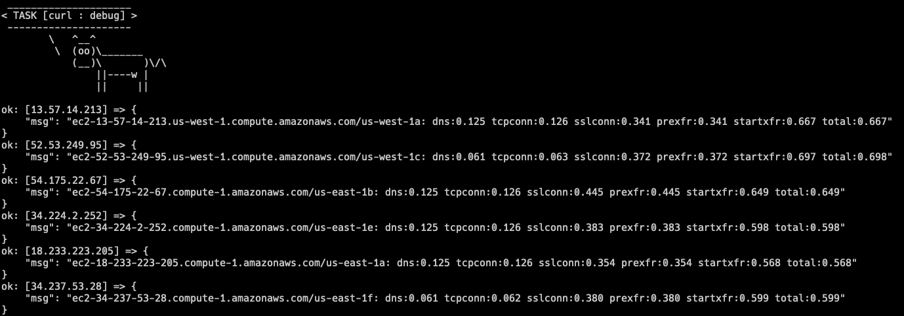

cloudbench-https
===

## About

cloudbench-https in a poor-man Pingdom-like reporting tool, aimed at spawning AWS EC2 instances in every public region and availability zone (at this moment of speaking 64 of them) and testing Web site reachability performance, displaying various timing information available from Curl timers in regards to DNS, TCP, SSL/TLS and TTFB information.

This stack consists of [Terraform](https://www.terraform.io/) infrastructure code that spawns 64+ EC2 instances with preferring single EC2 **t2.micro** instance per AZ and [Ansible](https://www.ansible.com/) playbook that configures software and runs test, delivering remote site timing information as final results.

Information being delivered from every AZ during testing is:

  - **dns**: time in seconds from the start to the completed DNS resolving
  - **tcpconn**: time in seconds from the start to the completed TCP connection to a remote host
  - **sslconn**: time in seconds from the start to the completed SSL/SSH/etc. connect/handshake to a remote host
  - **prexfr**: time in seconds from the start to the stage where everything is ready for the transfer (including all pre-transfer commands and negotiations)
  - **startxfr**: time in seconds from the start to the first byte to be transferred
  - **total**: time in seconds for the whole operation

This list of information is delivered per instance per AZ, so that it is possible to observe how well is the site performing across different regions (DNS-wise, CDN-wise, etc.) without any previous warmup.

## Requirements

Software needed:

  - [Terraform](https://www.terraform.io/)
  - [Ansible](https://docs.ansible.com/)

Also a working AWS EC2 credentials are required, typically stored in `$HOME/.aws/credentials`.

## Usage

Clone project:

```shell
git clone https://github.com/dkorunic/cloudbench-https
```
  
Configure remote Web site URL in `roles/curl/defaults/main.yml`, parameter to modify is `test_url`.
 
Make sure you have AWS credentials configured in `$HOME/.aws/credentials`.

Initialize Terraform:

```shell
terraform init
```

Apply the Terraform plan:

```shell
terraform apply -auto-approve
```

Apply Ansible playbook and watch the results:

```shell
ansible-playbook site.yml 2>&1 | tee log.txt
```

Finally destroy uneeded infrastructure:

```shell
terraform destroy -auto-approve
```

Required timing information will be available at the end of log.txt as well as any other possible error information.

## Demo

